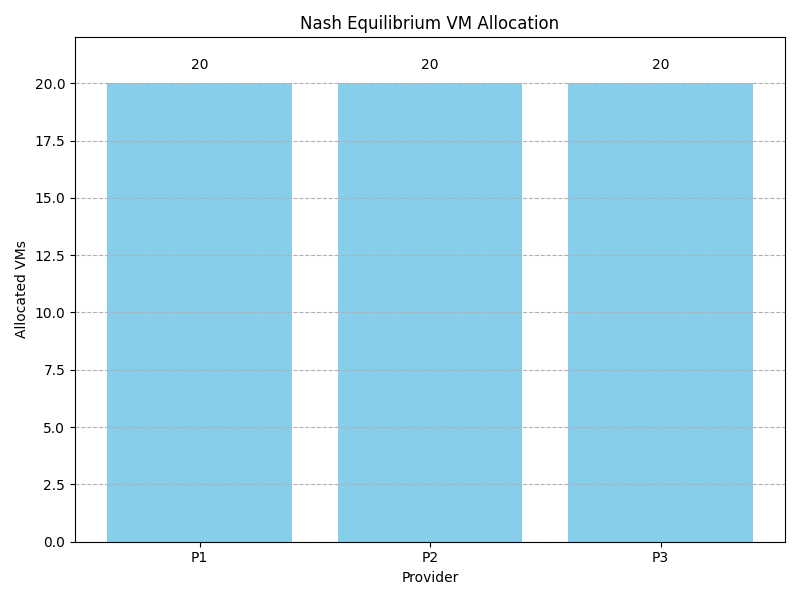
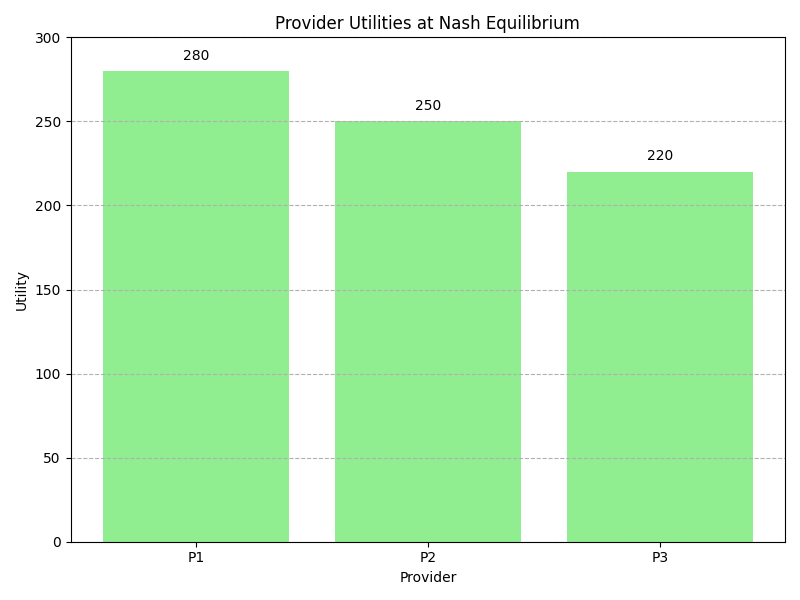
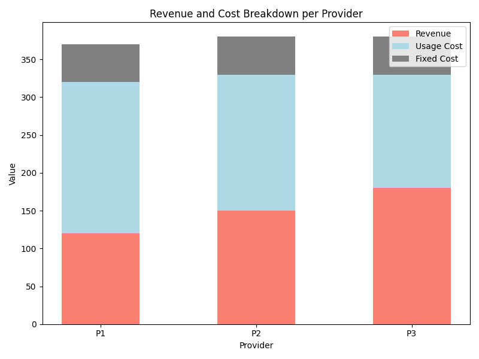
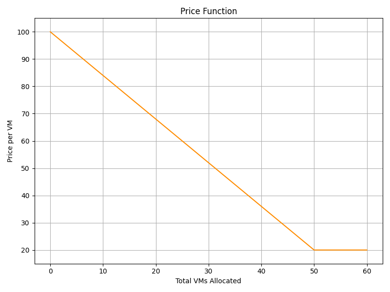

# Game-Theoretic Resource Allocation in Cloud Computing

This repository contains the LaTeX source code, simulation scripts, and generated figures for a research paper exploring game-theoretic approaches to resource allocation in cloud computing environments.  The project aims to address the challenges of efficiently distributing limited computational resources among competing users while maintaining fairness and system stability.

## Overview

Cloud computing resource allocation is a critical problem impacting system performance, user satisfaction, and provider revenue. Traditional allocation methods often prioritize either utilization or fairness, leading to suboptimal outcomes. This research proposes a game-theoretic framework that models resource allocation as a strategic interaction between users and providers.

The project employs two complementary approaches:

1.  **Non-Cooperative Game Model:** This model converges to a Nash Equilibrium, ensuring no user benefits from unilateral strategy changes.
2.  **Bargaining Game Model:** This model optimizes collective utility through cooperative negotiations.

Mathematical analysis integrates an M/M/n/n+l queuing model to quantify system behavior under dynamic workloads. Python simulations are used to validate the proposed models and analyze their performance.

## Key Findings and Visualizations

Here's a summary of the key findings visualized in the generated plots:

*   **Balanced VM Allocation under Nash Equilibrium:** This graph shows the VM allocation for each provider, demonstrating a relatively even distribution. This suggests a balanced and competitive market.

    

*   **Provider Utilities at Nash Equilibrium:** This plot showcases the utility achieved by each provider.  Note that utilities aren't perfectly equal, reflecting differing cost structures or other provider-specific factors.

    

*   **Revenue and Cost Breakdown:** This figure displays the breakdown of revenue, usage cost, and fixed cost for each provider. Analyzing this graph helps understand the key drivers of profitability.

    

*   **Diminishing Returns of VM Allocation:** This figure demonstrates how the utility shifts as the number of VMs allocated to one provider changes, assuming others allocate 10 VMs. Visualized is diminishing returns, where larger allocations gradually provide a lesser marginal utility (the slope decreases).

    .png)

*   **Decreasing Price Function:** The price function demonstrates a decreasing trend for VM allocations under 50 and a stable price thereafter, showing a clear relationship between demand and price.

    

## Project Structure

The repository is organized as follows:

*   `figures/`: Contains the generated figures illustrating simulation results (PNG files as shown above).
*   `venv/`: (Potentially) Contains a virtual environment for managing Python dependencies (if one was created).
*   `.gitignore`: Specifies intentionally untracked files that Git should ignore.
*   `main.tex`: The main LaTeX source file for the research paper.
*   `overleaf.py`: A Python script used to generate data and images for the simulation.

## Dependencies

To compile the LaTeX document and run the simulations, you will need the following dependencies:

*   **LaTeX Distribution:** A TeX distribution such as TeX Live, MacTeX, or MiKTeX is required to compile the `main.tex` file.
*   **Python 3:** Python 3 is required to run the simulation script (`overleaf.py`).
*   **Python Libraries:** The following Python libraries are required:
    *   `numpy`: For numerical operations. Install with: `pip install numpy`
    *   `matplotlib`: For creating plots and graphs. Install with: `pip install matplotlib`

## Instructions

1.  **Clone the Repository:**

    ```bash
    git clone [repository URL]
    cd [repository directory]
    ```

2.  **Set up a Python Environment (Recommended):**

    *   Create a virtual environment (optional, but recommended to isolate dependencies):

        ```bash
        python3 -m venv venv
        source venv/bin/activate  # On Linux/macOS
        venv\Scripts\activate  # On Windows
        ```

3.  **Install Python Dependencies:**

    ```bash
    pip install numpy matplotlib
    ```

4.  **Generate the Figures:**

    *   Run the `overleaf.py` script:

        ```bash
        python overleaf.py
        ```

        This will generate the image files in the `figures/` directory.
5.  **Compile the LaTeX Document:**

    *   Compile the `main.tex` file using your preferred LaTeX compiler (e.g., `pdflatex`, `xelatex`):

        ```bash
        pdflatex main.tex
        ```

        You may need to run this command multiple times to resolve all cross-references.
6.  **View the PDF:**

    *   Open the generated PDF file (`main.pdf`) to view the compiled research paper.

## License

[Specify the license under which the project is released (e.g., MIT License, Apache 2.0 License). Add a LICENSE file in the root directory with the full license text.]